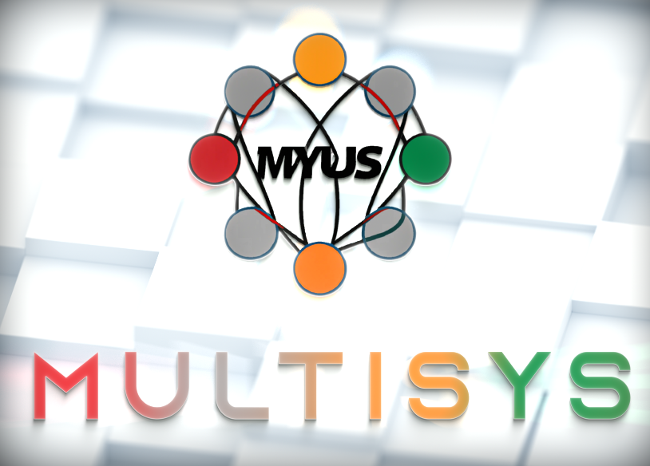

Specifications:
==================

• Name:             MultiSys

• Ticker:           MYUS

• PoW Algorithm:    X11KVS

• P2P Port:         10100

• RPC Port:         10101

• Block Time:       60 Seconds

• Difficulty Time:  60 Seconds

---

• PoW Blocks:       1 - 1000

• PoS Blocks:       Starting from 1001  

• Premine:          500,000 MYUS

• Maturity:         100 Confirmations  

• Max Supply:       Infinite

---

Links:
==================

• [Website](https://myus-coin.com/)

• [Explorer](https://blocks.myus-coin.com/)

---

